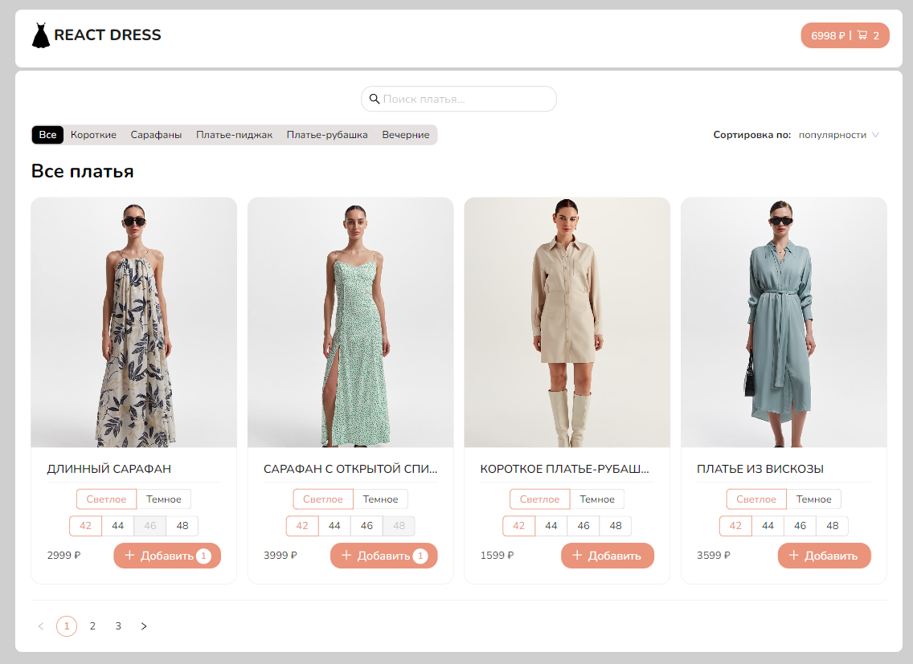

### react-dress

#### О проекте

Интернет-магазин платьев. Реализована возможность добавления товара в корзину, удаления товара из корзины, посчет общей стоимости товаров, поиск товара, сортировка товара по категориям, популярности, цене, алфавиту. Добавлена пагинация. Параметры фильтрации сохраняются в url. Также возможно просмотреть информацию о товаре на отдельной странице. Данные корзины сохраняются в LocalStorage. Оптимизированы перерисовки некоторых компонентов (React.memo). Бандл разделен на чанки (React.lazy). Работа с данными осуществляется через mockAPI.

#### Технологии

  
  
  
  
  
  

#### Установка и запуск приложения

<b>Развернуть</b>

Клонировать репозиторий:

    git clone https://github.com/Mariyazakharova73/react-dress.git

Установить зависимости:

    npm install

Собрать проект:

    npm run build

Запустить проект:

    npm start

[Ссылка на проект react-dress](https://mariyazakharova73.github.io/react-dress/)

  

